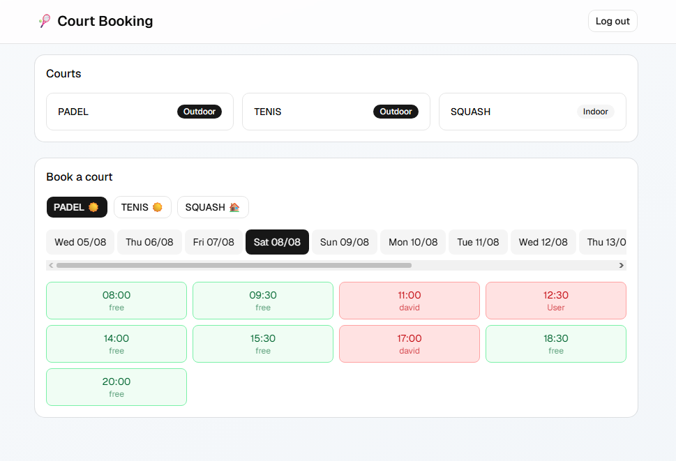

#  Court Booking

A full-stack, real-time court reservation system for padel, tennis and squash courts. Users register, browse available time slots on a live grid, and book courts — with instant updates pushed to every connected client and server-side protection against double-booking.

**🔗 Live demo:** [court-booking-wheat.vercel.app](https://court-booking-wheat.vercel.app)

> ⏳ The backend runs on a free Render instance that sleeps when idle — the first request after a while may take ~30–50 seconds to wake up.

---

##  Features

- **JWT authentication** — register & login with bcrypt-hashed passwords; protected endpoints guarded by a custom Spring Security filter.
- **Real-time availability** — when anyone books or cancels a slot, the grid updates instantly for all connected users via WebSockets (STOMP over SockJS). No refresh needed.
- **Double-booking prevention** — the backend rejects conflicting reservations at the data layer and returns a proper `409 Conflict`, so two users can never grab the same slot.
- **Ownership rules** — users can only cancel their own reservations; the API enforces this and rejects everything else.
- **Smart slot grid** — a rolling 2-week window of fixed 90-minute slots, with different opening hours for weekdays (12:00–20:00) and weekends (08:00–22:00). Past slots are hidden automatically.

---

##  Tech stack

**Backend**
- Java 21 · Spring Boot
- Spring Security + JWT (jjwt)
- Spring Data JPA / Hibernate
- WebSocket (STOMP + SockJS)
- MySQL

**Frontend**
- React (Vite)
- Tailwind CSS + shadcn/ui
- STOMP.js + SockJS client

**Deployment**
- Frontend → Vercel
- Backend → Render (Docker)
- Database → Clever Cloud (MySQL)

---

##  Architecture


The frontend authenticates against the backend and stores a JWT. Every protected request carries the token, which a custom `JwtFilter` validates on the way in. When a reservation changes, the server broadcasts an event over `/topic/reservations`, and every client re-fetches — keeping the grid in sync in real time.

---

##  Screenshots



##  Running locally

**Prerequisites:** Java 21, Node.js, and a running MySQL instance (e.g. via XAMPP).

### Backend

```bash
# from the project root
./mvnw spring-boot:run
```

Set these environment variables (e.g. an empty local DB called `court_booking`):

| Variable       | Example                                          |
|----------------|--------------------------------------------------|
| `DB_URL`       | `jdbc:mysql://localhost:3306/court_booking`       |
| `DB_USER`      | `root`                                            |
| `DB_PASSWORD`  | *(empty for default XAMPP)*                        |
| `JWT_SECRET`   | any string of 32+ characters                       |

Hibernate creates the tables automatically on first run.

### Frontend

```bash
cd frontend
npm install
npm run dev
```

Create a `frontend/.env` file:

```
VITE_API_URL=http://localhost:8080
```

The app runs on `http://localhost:5173`.

---

##  Notes

Roles (admin vs. user) were intentionally left out of this project — its focus is booking logic, real-time updates and concurrency handling. Admin/user separation is demonstrated in a separate e-commerce project.

---

##  Author

**Dávid**
[GitHub](https://github.com/Ha-Khu) · [LinkedIn](https://linkedin.com/in/david-plevka) · [Portfolio](https://ha-khu.github.io/Portfolio)
